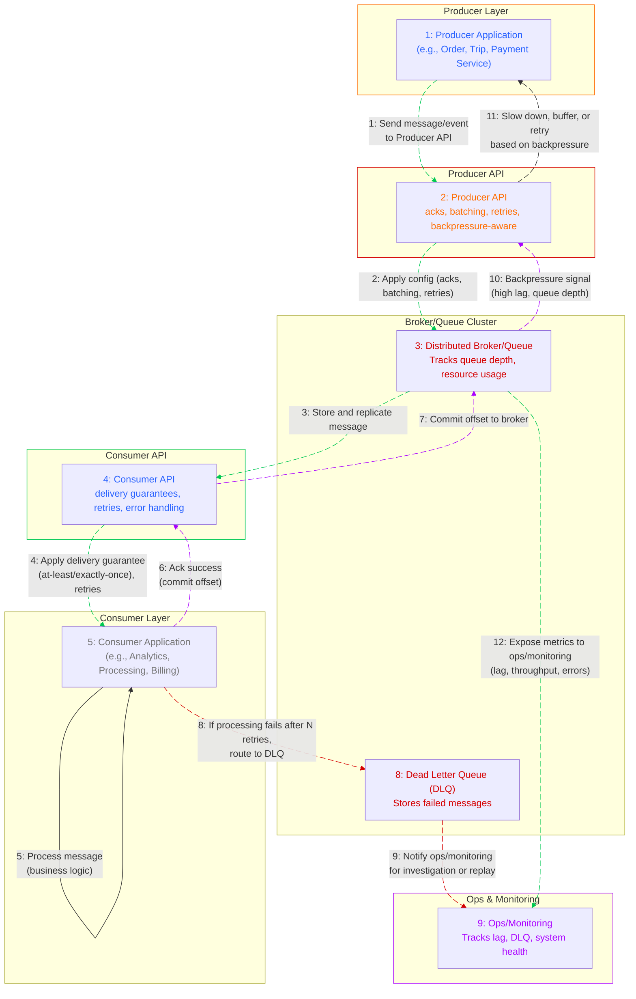

# 📘 System Design Concepts for Interviews

A curated collection of system design articles by [ScalaBrix](https://medium.com/@scalabrix), covering topics essential for mastering system design interviews and building scalable, resilient systems.

---

---
## 📜 System Architecture Concepts and Problems
| #️⃣ | 📝 Title | 🔗 Link | 📅 Date | 📖 Description | 🏷️ Status |
|:---:|:--------|:-------|:-------:|:--------------------|:---------:|
| 1 | **System Architecture : Client-Side Caching Layer with ETag Validation** | [Read Here](https://scalabrix.medium.com/system-architecture-client-side-caching-layer-with-etag-validation-67b2ce6e3347) | Apr 2, 2025 | *Decentralized caching meets intelligent ETag validation — scale faster, load smarter, fail gracefully.* |  |
| 2 | **System Architecture : Distributed Cache Invalidation Service** | [Read Here](https://levelup.gitconnected.com/system-architecture-distributed-cache-invalidation-service-cab59eeeee15) | Apr 3, 2025 | *Design and Architect a Distributed Cache Invalidation Service at Scale* |  |
| 3 | **System architecture : Idempotency in Payment Transactions** | [Read Here](https://levelup.gitconnected.com/system-architecture-idempotency-in-payment-transactions-1d7888480648) | Apr 4, 2025 | *Design a Scalable and Production-Ready Idempotent Payment Processing System to Prevent Double Transactions Due to Retries.* |  |
| 4 | **System architecture : Enterprise-Grade Load Balancing Architecture** | [Read Here](https://levelup.gitconnected.com/system-architecture-enterprise-grade-load-balancing-architecture-9dd774e508aa) | Apr 5, 2025 | *Designing Multi-Layered Load Balancers with Failover, Autoscaling, and Observability* |  |
| 5 | **System architecture : Handling Backpressure in a Cloud-Based Video Streaming Service** | [Read Here](https://scalabrix.medium.com/system-architecture-handling-backpressure-in-a-cloud-based-video-streaming-service-338c554657e7?source=list---------4-------7b12980141be----------------------------) | Apr 6, 2025 | *Architecting High-Performance Video Platforms That Never Crash Under Load.* |  |
| 6 | **System architecture : High Throughput Reads & Writes in Databases (p2)** | [Read Here](https://scalabrix.medium.com/system-architecture-high-throughput-reads-writes-in-databases-p2-44f92c2f383d?source=list---------5-------7b12980141be----------------------------) | Apr 7, 2025 | *How CQRS Solves 1M QPS Challenge for DB read/write along with failover and resiliency strategies.* |  |
| 7 | **System architecture : High Throughput Reads & Writes in Databases (p1)s** | [Read Here](https://scalabrix.medium.com/system-architecture-deep-dive-into-1m-rps-api-design-fa5b5a01e6f4?source=list---------7-------7b12980141be----------------------------) | Apr 8, 2025 | *How Read/Write Separation Solves 1M QPS Challenge for DB read/write.* |  |
| 8 | **System Architecture : Deep Dive into 1M RPS API Design** | [Read Here](https://scalabrix.medium.com/system-architecture-deep-dive-into-1m-rps-api-design-fa5b5a01e6f4?source=list---------7-------7b12980141be----------------------------) | Apr 9, 2025 | *Technology-agnostic design for high-throughput systems, ensuring low latency, high availability, and cost efficiency.* |  |
| 9 | **System architecture: On-Demand Code Execution System (Part 2)** | [Read Here](https://scalabrix.medium.com/system-architecture-on-demand-code-execution-system-part-2-0ada8f167da4?source=list---------8-------7b12980141be----------------------------) | Apr 10, 2025 | *Distributed, event-driven, microservices-based architecture for On demand code execution system Job Retry, Secure execution, Failure recovery workflows*|  |
| 10 | **System architecture: On-Demand Code Execution System (Part 1)** | [Read Here](https://scalabrix.medium.com/system-architecture-on-demand-code-execution-system-part-1-95eada80ec16?source=list---------9-------7b12980141be----------------------------) | Apr 11, 2025 | *Distributed, event-driven, microservices-based architecture for On demand code execution system.* |  |
| 11 | **System architecture: Coding Contest & Leaderboard** | [Read Here](https://scalabrix.medium.com/system-architecture-coding-contest-leaderboard-6819964459e0?source=list---------10-------7b12980141be----------------------------) | Apr 12, 2025 | *Distributed microservices based architecture for handling thousands of concurrent participants in a coding contest and leaderboard.* |  |
| 12 | **System Architecture: Distributed task scheduling service** | [Read Here](https://scalabrix.medium.com/system-architecture-distributed-task-scheduling-service-46b293335bb8?source=list---------11-------7b12980141be----------------------------) | Apr 13, 2025 | *Microservices/event-driven worker-based architecture of highly scalable distributed task scheduling service.* |  |
| 13 | **System architecture : Content Aggregator (e.g., News/Articles) platform** | [Read Here](https://scalabrix.medium.com/system-architecture-content-aggregator-e-g-news-articles-platform-162e5f444507?source=list---------13-------7b12980141be----------------------------) | Apr 14, 2025 | *Microservices-Based Event-Driven Hybrid Architecture of Content Aggregator platform* |  |
| 14 | **System architecture : Ticket Booking System** | [Read Here](https://scalabrix.medium.com/system-architecture-ticket-booking-system-080b7df4a550?source=list---------14-------7b12980141be----------------------------) | Apr 15, 2025 | *Architecture for highly Scalable and Resilient Ticket Booking System.* |  |
| 15 | **System architecture : Online Forum (Part 1)** | [Read Here](https://scalabrix.medium.com/system-architecture-online-forum-part-1-6f888c967581?source=list---------15-------7b12980141be----------------------------) | Apr 16, 2025 | *Distributed Microservices Architecture with Real-Time and Caching Layers for Online Forum.* |  |
| 16 | **System Architecture : Payment Wallet** | [Read Here](https://scalabrix.medium.com/system-architecture-payment-wallet-g-pay-5b7901edee81?source=list---------16-------7b12980141be----------------------------) | Apr 17, 2025 | *TMicroservice based architectural design for Payment wallet.* |  |

---
---

## 📊 Project Metrics

   
  
  
  

---

> 🚀 *Thank you for visiting! Feel free to star ⭐ the repo, fork 🍴 it, or clap 👏 on Medium if you found this useful!*

