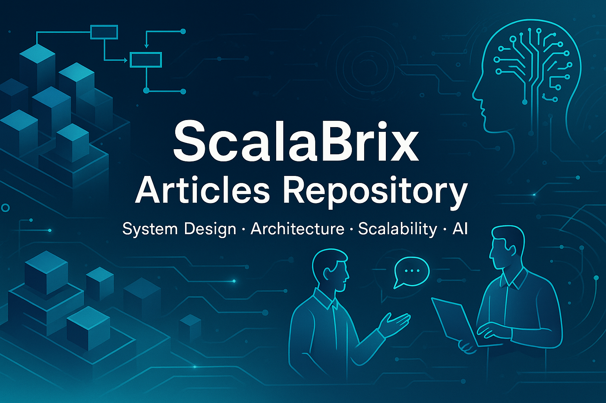

# 📘 🏆 System Design Excellence – Ace Interviews & Build Enterprise Systems
*By [ScalaBrix](https://medium.com/@scalabrix) – Production-grade System Architecture Insights*

  

---
# 🚀 System Design Interview Playbook – Master Scalable Architecture, Distributed Systems & Real-World Patterns

## 📚 A Complete System Design Preparation Roadmap  
Covering **fundamentals**, **scalability strategies**, **database design**, **caching**, and **high-availability architectures** — for both **interview success** and **production excellence**.  
Learn how to build **scalable systems**, design **fault-tolerant architectures**, and apply **real-world system design patterns** to ace your next **system design interview**. (Collection of 50+ Unique System Design and Architecture Concepts and Problem Statements with in depth solution)

## 🗺️ How to Use This Playbook
> 🛠 **Build from core principles** before diving into advanced systems.  
> 📈 **Progress logically** from fundamentals → high-scale architectures → specialized patterns.  
> 🎯 **Focus your prep** like an actual interview roadmap.  

**Your Journey:**  
1️⃣ **Foundation Layer** – Core building blocks & fundamentals  
2️⃣ **Data Mastery** – Databases, caching & async workflows  
3️⃣ **Scale & Reliability** – High-QPS, load balancing, fault tolerance  
4️⃣ **Domain Expertise** – Real-world product architectures & case studies  

> Each article includes **real-world trade-offs**, **scaling math**, and **production blueprints**.

---

## 📚 Table of Contents
- [🏗 Fundamentals & Core Building Blocks](#-fundamentals--core-building-blocks)
- [🗄 Database Design & High-Throughput Patterns](#-database-design--highthroughput-patterns)
- [⚡ Caching, Invalidation & Read Path Acceleration](#-caching-invalidation--read-path-acceleration)
- [🧵 Async, Orchestration & Worker Architectures](#-async-orchestration--worker-architectures)
- [🛰 Distributed Query, Logging & Analytics](#-distributed-query-logging--analytics)
- [📣 Feeds, Fan-Out & Notifications](#-feeds-fanout--notifications)
- [🛡 Security, Zero-Trust & Governance](#-security-zerotrust--governance)
- [📶 Load Balancing, Backpressure & SLOs](#-load-balancing-backpressure--slos)
- [🧭 Real-Time Detection, Counters & Monitoring](#-realtime-detection-counters--monitoring)
- [🧪 Code Execution, Contests & Scheduling](#-code-execution-contests--scheduling)
- [🏛 Domain Case Studies (Product Architectures)](#-domain-case-studies-product-architectures)
- [🤖 Agent Era & Next-Gen Architectures](#-agent-era--nextgen-architectures)
- [📊 Project Metrics](#-project-metrics)
- [🤝 Contributing](#-contributing)

---

## 🏗 Fundamentals & Core Building Blocks
| # | Title | Link | What You’ll Learn | Status |
|---|-------|------|-------------------|:-----:|
| 1 | **Unlocking Scalability: Building Blocks (p1)** | [Read](https://scalabrix.medium.com/unlocking-scalability-the-essential-building-blocks-of-distributed-system-architecture-p1-283c9eed430c)  | Queues, Topics, Partitions, Consumer Groups, Offsets |  |
| 2 | **Unlocking Scalability: Advanced Blocks (p2)** | [Read](https://scalabrix.medium.com/unlocking-scalability-advanced-building-blocks-for-distributed-systems-p2-eff6d541f6ef) | Backpressure, DLQs, API reliability patterns |  |
| 3 | **Beyond Resilience: Operational Blocks (p3)** | [Read](https://medium.com/@scalabrix/beyond-resilience-operational-building-blocks-for-distributed-systems-p3-c000c110e773) | Alerting, Auto-Scaling, Self-Healing ops |  |
| 4 | **Distributed Queue vs Pub/Sub, Choosing the Right Pattern for Scalable Systems** | [Read](https://medium.com/gitconnected/hld-distributed-queue-vs-pub-sub-choosing-the-right-pattern-for-scalable-systems-a3d8a1562cae) | Workload Distribution vs Event Fanout — Cracking the Core Trade-Off in Modern Distributed Architectures |  |
| 5 | **Blueprints of Scale** | [Read](https://medium.com/@scalabrix/blueprints-of-scale-distributed-systems-p1-1b0cb912cc05) | From hot partitions to idempotency keys, bite-sized deep dives into the scaling challenges engineers face every day |  |
| 6 | **Async Workflow Pattern for Microservices (Orchestrated Saga + Outbox)** | [Read](https://medium.com/gitconnected/hld-concepts-async-workflow-pattern-for-microservices-orchestrated-saga-outbox-aa9afaa5185b) | HLD for reliable, versioned, event-driven workflows |  |

---

## 🗄 Database Design & High-Throughput Patterns
| # | Title | Link | What You’ll Learn | Status |
|---|-------|------|-------------------|:-----:|
| 1 | **DB Design: Multi-Tenant Data Isolation** | [Read](https://medium.com/@scalabrix/db-design-multi-tenant-data-isolation-in-a-shared-database-b313feca233c) | Tenant isolation in shared DBs without cost explosion |  |
| 2 | **Rethinking Database Access: Zero-Trust & IAM** | [Read](https://medium.com/@scalabrix/rethinking-database-access-zero-trust-iam-tokens-and-least-privilege-at-scale-820aee28b2d3) | IAM tokens, least privilege, real-time auth to DB |  |
| 3 | **High Throughput Reads/Writes (Read-Write Separation)** | [Read](https://scalabrix.medium.com/system-architecture-deep-dive-into-1m-rps-api-design-fa5b5a01e6f4) | Split read vs write paths to hit 1M QPS |  |
| 4 | **High Throughput Reads/Writes (CQRS)** | [Read](https://scalabrix.medium.com/system-architecture-high-throughput-reads-writes-in-databases-p2-44f92c2f383d) | CQRS patterns, failover & resiliency for DB scale |  |
| 5 | **Hot-Key Bucketing: The Hidden Architecture That Lets Distributed Systems Survive Viral Traffic** | [Read](https://medium.com/gitconnected/hot-key-bucketing-the-hidden-architecture-that-lets-distributed-systems-survive-viral-traffic-4ced0f2d8fcf) | How breaking one overloaded key into many bucketed keys transforms a hotspot into a horizontally scalable, fault-tolerant workload |  |

---

## ⚡ Caching, Invalidation & Read Path Acceleration
| # | Title | Link | What You’ll Learn | Status |
|---|-------|------|-------------------|:-----:|
| 1 | **Distributed Cache Invalidation Service** | [Read](https://levelup.gitconnected.com/system-architecture-distributed-cache-invalidation-service-cab59eeeee15) | Consistent invalidation across distributed nodes |  |
| 2 | **Client-Side Caching with ETag Validation** | [Read](https://scalabrix.medium.com/system-architecture-client-side-caching-layer-with-etag-validation-67b2ce6e3347) | Save server load with smart validation |  |
| 3 | **Cluster-Wide Cache Warm-Up Service** | [Read](https://medium.com/gitconnected/system-architecture-cluster-wide-cache-warm-up-service-7b33b353a368) | Pre-warming strategies for cold-start & scale |  |
| 4 | **Read-Heavy Service w/ Regional Cache Replicas** | [Read](https://levelup.gitconnected.com/system-architecture-read-heavy-service-with-regional-cache-replicas-d79a02738a6d) | Geo-replicated read path, low latency design |  |
| 5 | **Feature Flag Control Plane for 1000+ Tenants** | [Read](https://medium.com/gitconnected/hld-feature-flag-control-plane-for-1000-tenants-fa963bcbab05) | How to design a production-grade, multi-tenant control plane with cache-first lookups, immutable versioning, and event-driven rollouts. |  |

---

## 🧵 Async, Orchestration & Worker Architectures
| # | Title | Link | What You’ll Learn | Status |
|---|-------|------|-------------------|:-----:|
| 1 | **Designing Robust Asynchronous Operations (p1)** | [Read](https://scalabrix.medium.com/designing-robust-asynchronous-operations-architecture-and-end-to-end-workflow-part-1-eaff509b6991) | End-to-end async flows, retries, backoffs |  |
| 2 | **Exactly-Once Processing for Distributed Workflows** | [Read](https://medium.com/gitconnected/system-architecture-exactly-once-processing-for-distributed-workflows-4bc4384fc658) | Idempotency, orchestration & compensation |  |
| 3 | **Auto-Scaling Worker Pools for Event Processing** | [Read](https://medium.com/gitconnected/system-architecture-auto-scaling-worker-pools-for-event-processing-at-scale-7cb3368ac8b9) | Feedback-driven elasticity, SLA-aware scaling |  |
| 4 | **Distributed Task Scheduling Service** | [Read](https://scalabrix.medium.com/system-architecture-distributed-task-scheduling-service-46b293335bb8) | Highly scalable scheduler architecture |  |

---

## 🛰 Distributed Query, Logging & Analytics
| # | Title | Link | What You’ll Learn | Status |
|---|-------|------|-------------------|:-----:|
| 1 | **Architecting Distributed Query Systems for Scale** | [Read](https://levelup.gitconnected.com/architecting-distributed-query-systems-for-scale-ae0e9e251a71) | Search/filter/aggregate at massive scale |  |
| 2 | **Distributed Top-K IP Query at Web-Scale** | [Read](https://levelup.gitconnected.com/distributed-top-k-ip-query-at-web-scale-b867c3b9e358) | Find heavy hitters across 500M+ logs |  |
| 3 | **From Log Chaos to Order (Kafka Log Merging)** | [Read](https://medium.com/gitconnected/from-log-chaos-to-order-scalable-reliable-log-merging-with-kafka-c6e4fdb1a38c) | Aggregating & streaming microservice logs |  |
| 4 | **Distributed Logging Systems at Scale (p1)** | [Read](https://scalabrix.medium.com/system-architecture-distributed-logging-systems-at-scale-p1-0d5d3dd4e436) | Multi-tenant, cost-efficient log platform |  |
| 5 | **Handling 1M Writes/sec with a Log-Based Ingestion Architecture** | [Read](https://levelup.gitconnected.com/handling-1m-writes-sec-with-a-log-based-ingestion-architecture-6d55fece2238) | Why traditional databases break under write pressure — and how decoupled, async ingestion systems make hyperscale writes reliable, resilient, and fast. |  |

---

## 📣 Feeds, Fan-Out & Notifications
| # | Title | Link | What You’ll Learn | Status |
|---|-------|------|-------------------|:-----:|
| 1 | **System Design Twitter: Scaling Timeline Writes** | [Read](https://medium.com/@scalabrix/system-design-twitter-scaling-timeline-writes-for-fast-reads-19f755abaded) | Fan-out-on-write at Twitter scale |  |
| 2 | **Fan-Out-on-Write (Blueprint)** | [Read](https://medium.com/@scalabrix/system-design-twitter-scaling-timeline-writes-for-fast-reads-19f755abaded) | Single write → millions of timelines |  |
| 3 | **High-Performance Fan-Out-on-Read** | [Read](https://levelup.gitconnected.com/architecting-a-high-performance-fan-out-on-read-system-b0c7a5a58536) | Deadline-bounded aggregation; partial failures |  |
| 4 | **Scaling Notification Fan-Out to 10M Devices** | [Read](https://medium.com/gitconnected/scalability-challenge-scaling-notification-fan-out-to-10-million-mobile-devices-2e2b6a967a3c) | Mobile push, batching, delivery guarantees |  |
| 5 | **How a Single Post Reaches Millions** | [Read](https://medium.com/@scalabrix/how-a-single-post-reaches-millions-inside-the-math-and-architecture-of-high-scale-fan-out-d770f307a8bc) | Per-stage payloads & latency math for fan-out |  |
| 6 | **Low-Latency Invalidation Fanout Service for Hot Cache Keys** | [Read](https://medium.com/gitconnected/system-architecture-low-latency-invalidation-fanout-service-for-hot-cache-keys-eaebc8120add) |  Architecture that detects hot keys, routes invalidation events across 10K+ cache nodes in under 10ms. |  |

---

## 🛡 Security, Zero-Trust & Governance
| # | Title | Link | What You’ll Learn | Status |
|---|-------|------|-------------------|:-----:|
| 1 | **Rethinking DB Access: Zero-Trust & IAM Tokens** | [Read](https://medium.com/@scalabrix/rethinking-database-access-zero-trust-iam-tokens-and-least-privilege-at-scale-820aee28b2d3) | Live, least-privilege access to data |  |
| 2 | **Distributed API Key Revocation Service** | [Read](https://levelup.gitconnected.com/system-architecture-distributed-api-key-revocation-service-8e79c4264ce9) | Instant key revocation across infra |  |

---

## 📶 Load Balancing, Backpressure & SLOs
| # | Title | Link | What You’ll Learn | Status |
|---|-------|------|-------------------|:-----:|
| 1 | **Enterprise-Grade Load Balancing Architecture** | [Read](https://levelup.gitconnected.com/system-architecture-enterprise-grade-load-balancing-architecture-9dd774e508aa) | Multi-layer LBs, failover, autoscaling, obs. |  |
| 2 | **Handling Backpressure in Video Streaming** | [Read](https://scalabrix.medium.com/system-architecture-handling-backpressure-in-a-cloud-based-video-streaming-service-338c554657e7) | Smoothing producers/consumers under load |  |
| 3 | **Deep Dive into 1M RPS API Design** | [Read](https://scalabrix.medium.com/system-architecture-deep-dive-into-1m-rps-api-design-fa5b5a01e6f4) | Throughput, latency, HA & cost trade-offs |  |

---

## 🧭 Real-Time Detection, Counters & Monitoring
| # | Title | Link | What You’ll Learn | Status |
|---|-------|------|-------------------|:-----:|
| 1 | **Distributed Anomaly Count: Detecting API Spikes** | [Read](https://levelup.gitconnected.com/distributed-anomaly-count-detecting-api-spike-surges-at-scale-3e25062fd0ae) | Multi-node spike/traffic surge detection |  |
| 2 | **Counting Every Click: Real-Time View Counters** | [Read](https://medium.com/@scalabrix/counting-every-click-architecture-behind-real-time-view-counters-at-scale-cd1d1f0261d6) | Live counters with accuracy & low latency |  |
| 3 | **Assigning 100K Unique Timestamps/sec** | [Read](https://medium.com/gitconnected/scalability-challenge-timestamp-assignment-service-07187e130464) | Global ordering & clock contention control |  |

---

## 🧪 Code Execution, Contests & Scheduling
| # | Title | Link | What You’ll Learn | Status |
|---|-------|------|-------------------|:-----:|
| 1 | **On-Demand Code Execution System (Part 1)** | [Read](https://scalabrix.medium.com/system-architecture-on-demand-code-execution-system-part-1-95eada80ec16) | Event-driven workers, sandboxing, isolation |  |
| 2 | **On-Demand Code Execution System (Part 2)** | [Read](https://scalabrix.medium.com/system-architecture-on-demand-code-execution-system-part-2-0ada8f167da4) | Secure execution, retries, failure workflows |  |
| 3 | **Coding Contest & Leaderboard** | [Read](https://scalabrix.medium.com/system-architecture-coding-contest-leaderboard-6819964459e0) | Concurrency at scale, ranking pipelines |  |
| 4 | **Distributed Task Scheduling Service** | [Read](https://scalabrix.medium.com/system-architecture-distributed-task-scheduling-service-46b293335bb8) | Time-based & event-driven scheduling at scale |  |

---

## 🏛 Domain Case Studies (Product Architectures)
| # | Title | Link | What You’ll Learn | Status |
|---|-------|------|-------------------|:-----:|
| 1 | **Payment Wallet** | [Read](https://scalabrix.medium.com/system-architecture-payment-wallet-g-pay-5b7901edee81) | Microservice design for wallet/payments |  |
| 2 | **Ticket Booking System** | [Read](https://scalabrix.medium.com/system-architecture-ticket-booking-system-080b7df4a550) | Inventory, concurrency & seat locking |  |
| 3 | **Content Aggregator (News/Articles)** | [Read](https://scalabrix.medium.com/system-architecture-content-aggregator-e-g-news-articles-platform-162e5f444507) | Crawling, indexing, ranking, feeds |  |
| 4 | **Online Forum (Part 1)** | [Read](https://scalabrix.medium.com/system-architecture-online-forum-part-1-6f888c967581) | Real-time, caching & moderation flows |  |

---

## 🤖 Agent Era & Next-Gen Architectures
| # | Title | Link | What You’ll Learn | Status |
|---|-------|------|-------------------|:-----:|
| 1 | **The Blueprint: Modern System Design for the Agent Era (2025+)** | [Read](https://medium.com/gitconnected/the-blueprint-modern-system-design-for-the-agent-era-2025-4655230b193c) | Layered, production-ready agent platform |  |
| 2 | **Repackaging Microservices into Single-Tenant Monoliths** | [Read](https://medium.com/gitconnected/repackaging-microservices-into-single-tenant-monoliths-a-scalable-architecture-for-enterprise-saas-22fd168040b6) | Isolation + shared control/observability planes |  |
| 3 | **Distributed Prime Number Finder** | [Read](https://medium.com/gitconnected/distributed-prime-number-finder-scalable-sieve-architecture-for-1-billion-integers-80a06c0939d4) | Billion-scale parallel compute blueprint |  |

---

📢 **Stay Ahead in System Design!**  
Follow [ScalaBrix on Medium](https://medium.com/@scalabrix) for deep-dive articles, blueprints, and real-world case studies.  
⭐ **Star this repo** and subscribe to never miss an update on new system design content.

## 📊 Project Metrics

   
  
  
  

---

## 🤝 Contributing
- 🖊 Add case studies & architectural diagrams  
- 🛠 Improve patterns with trade-offs & benchmarks  
- ⭐ Star, 🍴 Fork, and 👏 Clap to support the project  

> 🚀 *Master the patterns. Ace the interview. Ship production systems with confidence.*

